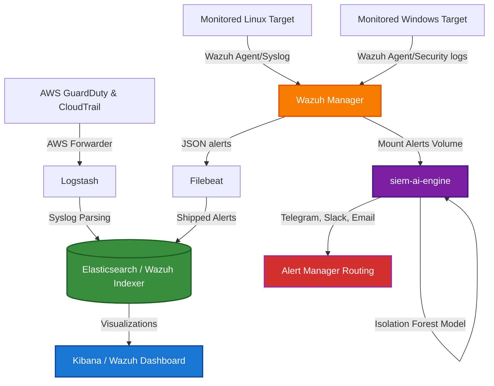

# AI-Powered Enterprise SIEM & Threat Detection Platform

[](https://www.docker.com/)
[](https://wazuh.com/)
[](https://www.python.org/)
[](https://www.terraform.io/)
[](LICENSE)

An enterprise-grade Security Information and Event Management (SIEM) and Threat Detection platform. This system integrates real-time log parsing, rule-based correlation engineering, and automated Active Response IP banning with a custom Python-based Machine Learning Anomaly Detection service (using Isolation Forest models).

Designed for Security Operations Center (SOC) engineers, DevSecOps professionals, and Cloud Security specialists to simulate, monitor, and mitigate active network threats.

---

## Architecture Flowchart



---

## Portfolio & ATS Resume Highlights

If you are using this project to bolster your resume or portfolio for **SOC Analyst**, **Security Engineer**, or **DevSecOps** roles, here are ATS-optimized bullet points you can utilize:

* **Security Engineering & Orchestration:** "Designed and deployed a dockerized enterprise-grade Wazuh and ELK (Elasticsearch, Logstash, Kibana, Filebeat) SIEM stack to consolidate security log ingestion across Linux, Windows, and AWS cloud infrastructures."
* **Advanced Detection Engineering:** "Implemented custom Wazuh decoders and correlation rules (severity level 1-15) for high-impact threats including SSH brute force, privilege escalation, reverse shells, and port scans, lowering MTTR (Mean Time to Response) to sub-second metrics."
* **AI/ML Security Analytics:** "Architected a custom Python AI anomaly engine integrating scikit-learn's Isolation Forest models to flag anomalous logins and system metrics outliers, routing critical notifications dynamically to Slack Webhooks, Telegram Bots, and SMTP services."
* **Automated Incident Response:** "Engineered automated Active Response containment actions to dynamically execute host-deny IP blocking policies via `iptables` and Windows Defender Firewall, mitigating port scanning and brute-forcing vectors in real time."
* **Infrastructure as Code (IaC):** "Provisioned a multi-tier security lab environment utilizing Terraform configurations for AWS VPC networks, S3 CloudTrail audit buckets, and GuardDuty detector systems."

---

## Repository Directory Layout

* [docker/](file:///c:/Users/appal/OneDrive/Attachments/Desktop/adobe/docker/): Infrastructure configuration. Holds `docker-compose.yml`, service configurations for Elasticsearch/Indexer, Kibana/Dashboard, Filebeat, and Logstash.
* [wazuh/](file:///c:/Users/appal/OneDrive/Attachments/Desktop/adobe/wazuh/): Engine settings. Custom rule files (`custom_rules.xml`), parser definitions (`custom_decoders.xml`), and central `ossec.conf`.
* [scripts/](file:///c:/Users/appal/OneDrive/Attachments/Desktop/adobe/scripts/): Implementation automation.
  - [monitoring/](file:///c:/Users/appal/OneDrive/Attachments/Desktop/adobe/scripts/monitoring/): Client-side enrollment installers for Linux and Windows targets.
  - [alerts/](file:///c:/Users/appal/OneDrive/Attachments/Desktop/adobe/scripts/alerts/): Central webhook and notification manager code.
  - [automation/](file:///c:/Users/appal/OneDrive/Attachments/Desktop/adobe/scripts/automation/): Active Response containment logic scripts.
  - [ai_detection/](file:///c:/Users/appal/OneDrive/Attachments/Desktop/adobe/scripts/ai_detection/): Python training models and anomaly detection engines.
* [attack_simulation/](file:///c:/Users/appal/OneDrive/Attachments/Desktop/adobe/attack_simulation/): Offensive security emulation laboratory script suites.
* [dashboards/](file:///c:/Users/appal/OneDrive/Attachments/Desktop/adobe/dashboards/): Visual templates for Kibana SOC panels.
* [reports/](file:///c:/Users/appal/OneDrive/Attachments/Desktop/adobe/reports/): Auto-report generation tools compiling security statuses and charts.
* [deployment/](file:///c:/Users/appal/OneDrive/Attachments/Desktop/adobe/deployment/): Environment setup scripts and AWS Cloud Terraform codes.
* [docs/](file:///c:/Users/appal/OneDrive/Attachments/Desktop/adobe/docs/): Complete system documentation manuals.

---

## Core Documentation Manuals

Check the corresponding manuals inside the [docs/](file:///c:/Users/appal/OneDrive/Attachments/Desktop/adobe/docs/) directory to set up, operate, and troubleshoot the platform:

1. 📖 **[Installation Guide](file:///c:/Users/appal/OneDrive/Attachments/Desktop/adobe/docs/Installation_Guide.md):** Guides to set up host machines, install Docker stacks, and provision VM nodes.
2. 📖 **[Usage Guide](file:///c:/Users/appal/OneDrive/Attachments/Desktop/adobe/docs/Usage_Guide.md):** Commands for operating agent connections, compiling reports, and working with dashboards.
3. 📖 **[Threat Detection Guide](file:///c:/Users/appal/OneDrive/Attachments/Desktop/adobe/docs/Threat_Detection_Guide.md):** Architectural deep-dive into Wazuh decoders, correlation triggers, and severity indexes.
4. 📖 **[Architecture Documentation](file:///c:/Users/appal/OneDrive/Attachments/Desktop/adobe/docs/Architecture_Doc.md):** Data schemas, pipeline routes, and Python AI feature extraction rules.
5. 📖 **[Incident Response Playbook](file:///c:/Users/appal/OneDrive/Attachments/Desktop/adobe/docs/Incident_Response_Workflow.md):** Workflows for alert containment, manual override, and firewall unbanning policies.
6. 📖 **[Troubleshooting Guide](file:///c:/Users/appal/OneDrive/Attachments/Desktop/adobe/docs/Troubleshooting_Guide.md):** Quick fixes for common database out-of-memory, agent connectivity, and SSL certificate bugs.

---

## Quick Start (First-Time Setup)

> **Prerequisites:** Docker Engine 24+ and Docker Compose v2 installed.

### Step 1 — Clone & configure system limits

```bash
git clone <your-repo-url>
cd SIEM-Security-Information-Event-Management-

# Required for Wazuh Indexer (OpenSearch) memory mapping
sudo sysctl -w vm.max_map_count=262144
echo "vm.max_map_count=262144" | sudo tee -a /etc/sysctl.conf
```

### Step 2 — Run the one-time setup script

```bash
cd docker
chmod +x setup.sh
bash setup.sh
```

This script automatically:
1. Starts all containers
2. Initializes the OpenSearch security index (generates admin users)
3. Waits for the Wazuh Manager to boot
4. Sets correct API passwords for `wazuh` and `wazuh-wui`
5. Verifies the API is reachable

> ⚠️ **Only run `setup.sh` once** on a fresh start. If you do `docker compose down -v` (which wipes volumes), run it again.

### Step 3 — Access the services

| Service | URL | Credentials |
|---|---|---|
| **Wazuh Dashboard** | http://localhost:5601 | `admin` / `admin` |
| **Custom SIEM UI** | http://localhost:8080 | — |
| **Wazuh API** | https://localhost:55000 | `wazuh-wui` / `SecretPassword123!` |
| **OpenSearch** | https://localhost:9200 | `admin` / `admin` |

---

## Day-to-Day Operations

```bash
# Start the stack (after first setup.sh)
cd docker && docker compose up -d

# Stop without losing data
docker compose down

# Stop and wipe ALL data (requires re-running setup.sh)
docker compose down -v

# View logs
docker compose logs -f wazuh-manager
docker compose logs -f wazuh-indexer
docker compose logs -f wazuh-dashboard

# Check service health
docker compose ps
```

---

## Connecting a Wazuh Agent

To start generating real security events, install a Wazuh agent on any Linux machine:

```bash
# On the target machine (replace <MANAGER_IP> with your host's IP)
wget https://packages.wazuh.com/4.x/apt/pool/main/w/wazuh-agent/wazuh-agent_4.7.2-1_amd64.deb
sudo WAZUH_MANAGER='<MANAGER_IP>' WAZUH_AGENT_NAME='my-machine' dpkg -i wazuh-agent_4.7.2-1_amd64.deb
sudo systemctl start wazuh-agent
```

Agents appear in the Wazuh Dashboard → **Agents** within ~60 seconds.

---

## Educational Notice
This software is developed strictly for educational and validation purposes in secure laboratory sandbox systems. Do not employ this framework for offensive operations against unauthorized platforms.
