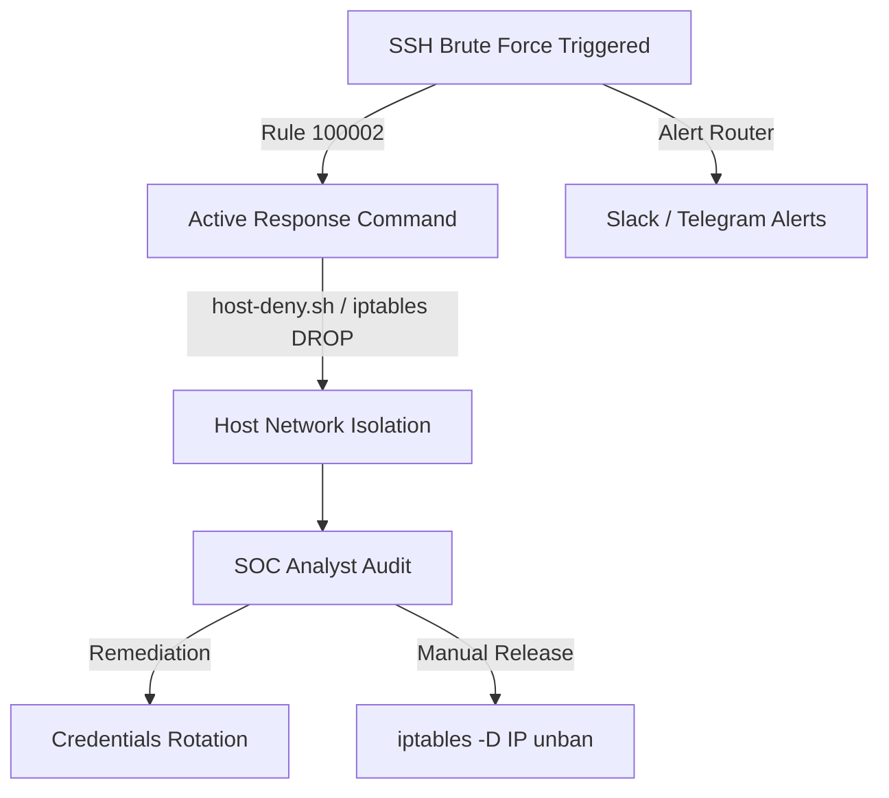

# Incident Response Playbook

This playbook maps out standard containment, mitigation, and recovery procedures when the SIEM platform flags critical attacks.

---

## Playbook 1: SSH Brute Force Mitigation



### 1. Identification
* **Trigger:** Rule ID `100002` ("SSH brute force attack detected from IP") or `100001` with high frequency.
* **Triage:** Review the source IP address in the Slack/Telegram alerts. Verify if it corresponds to an external address or an authorized developer's VPN.

### 2. Automated Containment
* **Active Response:** The Wazuh manager executes `active_response_block.py` which runs the iptables block command:
  ```bash
  iptables -A INPUT -s <ATTACKER_IP> -j DROP
  ```
* **Verify Block:** Check `/var/ossec/logs/active-responses.log` on the target agent to verify the ban action.

### 3. Eradication & Remediation
* **Rotate Credentials:** Force password resets for affected users.
* **Configure Hardening:** Disable password authentication in sshd config, enforcing SSH public key validation:
  ```text
  # Edit /etc/ssh/sshd_config
  PasswordAuthentication no
  PubkeyAuthentication yes
  ```
* Restart sshd service:
  ```bash
  systemctl restart ssh
  ```

### 4. Manual Unblock (Recovery)
If an authorized developer IP is banned:
1. Log in to the target machine.
2. View active firewall blocks:
   ```bash
   iptables -L INPUT -v -n --line-numbers
   ```
3. Remove the specific blocked IP rule row number:
   ```bash
   iptables -D INPUT -s <DEVELOPER_IP> -j DROP
   ```

---

## Playbook 2: Reverse Shell Compromise

### 1. Identification
* **Trigger:** Rule ID `100030` ("Reverse shell process spawning command detected").
* **Severity:** Level 12 (High Risk). Immediate action required.

### 2. Immediate Containment
* **Isolate Network:** If running on AWS, modify security group parameters of the affected instance to block all incoming/outgoing traffic except connection tunnels for administrative forensics:
  - Revoke broad ports `80`, `443`, and `22`.
  - Attach the "Forensic Isolation" security group.
* **Process Termination:** Terminate the active reverse shell processes. List processes running shells:
  ```bash
  ps aux | grep -E "nc|bash|sh|python"
  ```
  Kill the shell processes:
  ```bash
  kill -9 <PID>
  ```

### 3. Eradication & Vulnerability Patching
* **Find Web Shells:** Inspect web server folders (e.g. `/var/www/html/`) for newly modified PHP/JS files representing backdoor loaders:
  ```bash
  find /var/www/html/ -mtime -3 -type f
  ```
* **Check Cron Persistent Files:** Verify user and system cron files for malicious persistence scripts:
  ```bash
  crontab -l
  cat /etc/crontab
  ls -la /etc/cron.d/
  ```

### 4. Recovery
* Redeploy compromised containers or restore system volumes from clean snapshots.
* Verify file integrity metrics inside the Wazuh Dashboard to ensure system configurations are restored.
